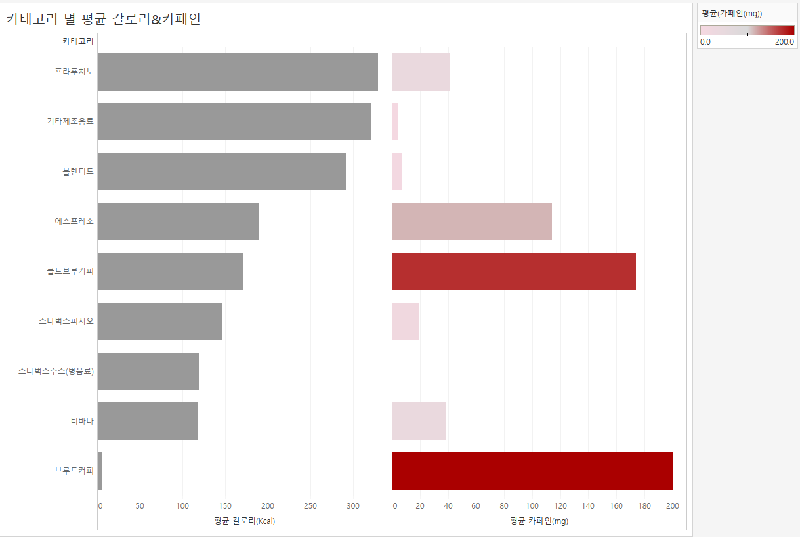

## Tableau 1일차 과제
### 막대 차트를 이용해 카테고리 별 평균 칼로리와 평균 카페인을 비교하는 시각화

왜 막대 차트를 사용할까 그 이유를 한 번쯤 생각해 보신 적 있으신가요?
막대 차트는 값의 크기를 비교하는데 유용한 시각화 입니다. 

막대 차트처럼 값을 길이로 표현할 수도 있고, 버블 차트처럼 값을 원의 크기를 통해서 표현할 수도 있습니다.

막대 차트를 통해 값을 비교해 보면 독일이 가장 매출 값이 크다는 것을 알 수 있지만, 버블의 크기로는 값의 차이를 비교하기 쉽지가 않습니다. 
우리의 뇌는 크기나 너비 보다는 길이를 비교하는데 좀 더 특화되어 있다고 해요.  

이처럼 막대 차트는 수치 데이터 값들 간의 작은 양적 차이를 비교하는데 유용하기 때문에 가장 많이 사용 되는 시각화 중에 하나인거죠. 

그리고 막대 차트는 특정 참조선(ex. 평균값, 중간값) 등을 표현해 해당 막대가 그 참조선 값에 도달했는지 도달하지 못했는지 비교할 수도 있고, 
바인바(Bar in Bar) 차트 등을 통해 목표값에 도달했는지 아닌지 등도 살펴볼 수 있는 등 추가적으로 시각화를 발전시켜 나가기에도 용이합니다.

그렇다면 버블 차트는 사용하지 말아야 할 시각화일까요? 
버블 차트는 정확한 값의 비교가 아닌 전체적인 데이터의 트렌드를 본다거나 대시보드에서 필터로 유용하게 사용할 수 있습니다. 

따라서 **막대 차트를 사용하실 때는 비슷한 값들의 비교를 명확하게 하기 위해서 데이터를 정렬하는 것을 권장**합니다.

### `시각화1`
1. 열 선반은 칼로리, 카페인 설정하고 행 선반은 카테고리 별로 설정.
2. 칼로리와 카페인의 집계 형태를 평균으로 변경.   
*왜 집계를 평균으로 변경해야 할까요?*
: 하나의 카테고리 안에는 여러 개의 메뉴가 있기 때문에 카테고리를 기준으로 합계로 집계한다면 카테고리 안에 있는 메뉴들의 칼로리와 카페인 값이 모두 더해져서 총 합계 칼로리, 총 합계 카페인 값이 보여지기때문이다. 카테고리 별로 평균 칼로리와 평균 카페인 값을 보는것이 좋을 것 같다.
3. 평균 칼로리와 평균 카페인을 표현하기 위에 각각 2개의 축이 생김.   
**평균 카페인을 표현하는 오른쪽 막대에만 “평균 카페인”을 이용해 색상을 표현.**
(색상을 표현할 때는 카페인이 높을수록 붉은색을 띠도록.)

4. 평균 칼로리를 기준으로 정렬.

### 메뉴명 별 칼로리 & 카페인
- 트리맵으로 나타내기
트리맵은 계층 구조의 데이터를 표시하는데 적합한 시각화로 전체 대비 부분의 비율이 얼마나 되는지 비교하는데 많이 사용. 
사각형의 크기와 색상에 따라 데이터의 패턴을 확인할 수 있을 뿐만 아니라 많은 데이터를 한 번에 볼 수 있다는 장점이 있음. 
- 칼로리는 사각형의 크기로, 카페인은 색상으로 표현

### `시각화2`

1번 과제에서는 카테고리를 기준으로 칼로리와 카페인의 평균 값을 계산 했다면, 
2번 과제에서는 메뉴명을 기준으로 칼로리와 카페인 값을 계산하는 것이죠. 

그런데 현재 데이터의 가장 낮은 행 수준이 메뉴명이에요. 즉, 메뉴명은 유일하게 구분되고 중복되지 않는 값이죠. 
따라서 하나의 메뉴명에는 하나의 칼로리, 하나의 카페인 값이 있어요.

즉, 메뉴명을 기준으로 칼로리, 카페인 값을 합계로 계산하나 평균으로 계산하나 결과는 동일합니다.
따라서 별도로 집계를 변경해주지 않은 것입니다.

### 3. 카테고리와 메뉴명을 한 번에 살펴보기

카테고리 기준으로 만든 시트와 메뉴명 기준으로 만든 시트를 한 번에 살펴 봅시다. 
카테고리에 마우스 오버하면, 해당 카테고리에 해당되는 메뉴를 살펴보도록 합니다. 

### 4. 당분 함유량과 칼로리 상관관계

당분 함유량이 높을 수록 칼로리가 높을까요? 당분과 칼로리의 상관관계를 살펴봅시다!

이번 시각화에서는 스캐터 플롯 (산점도) 시각화를 이용해 볼 예정이에요. 

스캐터 플롯은 2개의 연속형 데이터에 대한 상관관계를 분석하는데 가장 많이 사용되는 시각화 입니다. 
두 개의 축으로 데이터가 얼마나 퍼져 있는지 분포를 살펴 볼 수 있고, 상수 라인 / 평균 라인 / 사분위수 및 중앙값 / 추세선 등과 같은 참조 라인을 추가하여 값의 분포를 비교하기에도 유용합니다.

### 5. 시군구 별 매장 분포 현황

어디 시군구에 스타벅스가 가장 많을까요? 시군구 별 매장의 분포를 맵을 이용해 살펴봅시다.  

