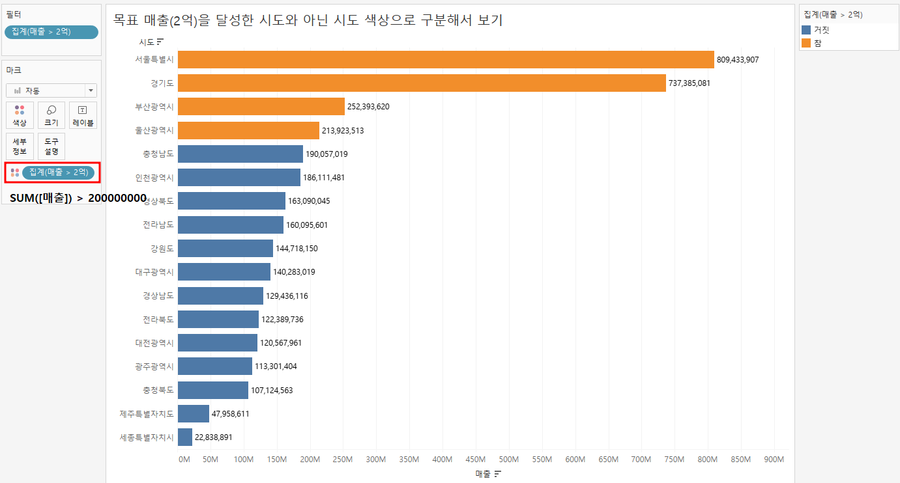

## SUM이 불러오는 엄청난 차이
### 행 수준 계산식
- 모든 행에 대해 계산 후 결과 값을 집계
- 수익 / 매출
- 모든 행에 대해 결과 값이 실체화 되기 때문에 처리 로직을 다시 실행할 필요가 없음.

### 집계 수준 계산식
- 각 필드 값을 집계한 후에 계산
- SUM([수익]) / SUM([매출])
- 뷰에 사용된 차원에 따라 집계 값이 달라지기 때문에 Tableau 데이터 추출에서 실체화 될 수 없음.

### 목표 매출(2억)을 달성한 시도와 아닌 시도 색상으로 구분해서 보기
  

- 행수준 연산: 열과열의연산, 문자열처리, 형변환, 날짜/시간계산 ...
