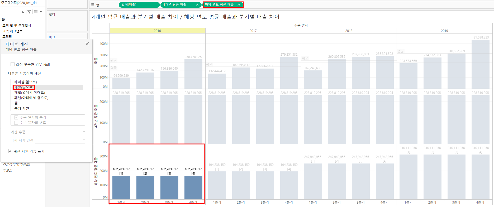
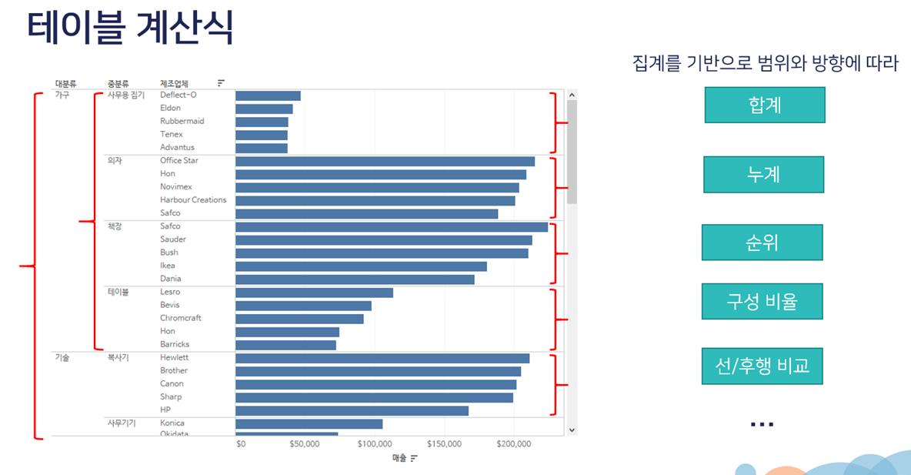

## 태블로 계산 유형
### 행 데이터 > 집계 > 테이블 계산식
: 그런데, 분석된 요건에 따라서 집계값을 이용하여 다시 한번 값을 재계산해야될 경우 테이블계산식을 사용.
* 주의: 테이블 계산식 같은 경우 집계된 값을 다시 한번 구하는것이기에 구할 때 어느범위까지 구할건지 어느방향으로 구할지 제대로 지정을 해주어야된다.
  

## 테이블 계산식
집계를 기반으로 범위와 방향에 따라
합계, 누계, 순위, 구성 비율, 선/후행 비교 ...
도출해 낼 수 있다.   
  