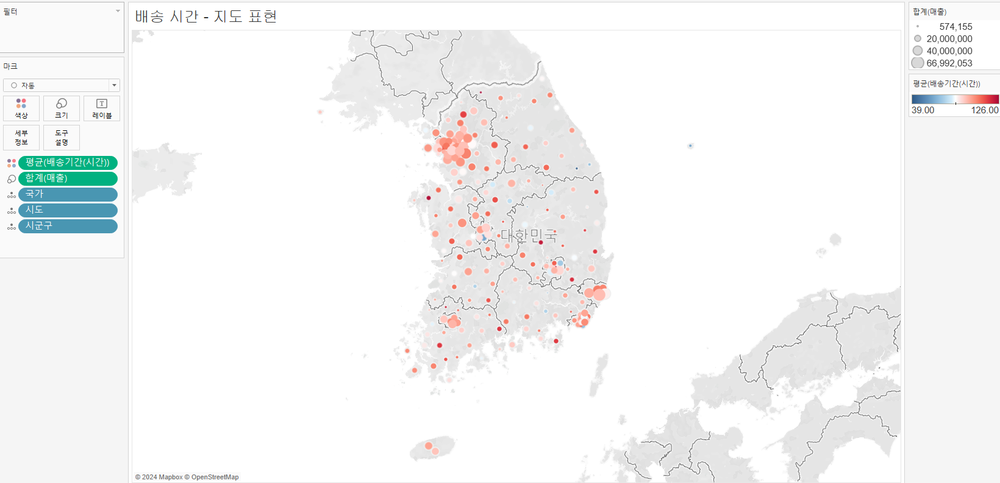
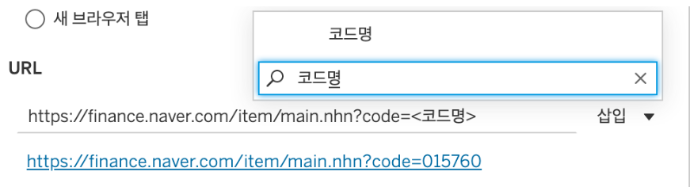
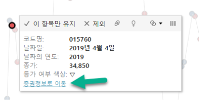

# 고급계산식

## 배송시간:  XX 시간 YY 분 으로 표현하기
- INT([배송기간(분)]/60)
- DATEDIFF('minute',[주문 일자],[배송 일자])
- [배송기간(분)]-([배송기간(시간)]*60)
- 남은 분 계산: STR([배송기간(시간)])+'시간'+STR([배송기간(남은 분)])+'분'

## 배송시간 - 지도표현


## 세부수준 계산식
```python
{[INCLUDE|EXCLUDE|FIXED][차원]...: 집계식([측정값])}
```
- 고객 당, 주문 당 등 '~당' 계산이 필요한 경우
- 집계를 다시 집계해야되는 상황
- 집계 결과를 기준으로 구간을 나눠야 하는 경우
- 뷰에서 보고 있는 수준보다 아래 또는 위 수준에서 계산 결과를 만들어야 하는 경우 

### INCLUDE|EXCLUDE|FIXED
```python
{[FIXED][제품 대분류]: SUM([매출])} # 고정
{[EXCLUDE][제품 중분류]: SUM([매출])} # 제외
{[INCLUDE][지역]: SUM([매출])} # 포함되지 않은 특정 차원을 포함하고 싶을 때
```

## 테이블 계산식의 원리는?
```테이블 계산식은 “Raw Data”를 “집계한 값 (Aggregation)”을 가지고 “테이블 계산 (Table Calculation)”을 실행합니다.```   
ex) 우리는 국가별 가격 변동 비율을 구하기 위해서   
(1) Dollar Price(Raw Data)의 합계(Aggregation) 를 구하고,    
(2) 그 합계 값을 가지고 “구성비율”이라는 테이블 계산식(Table Calculation)을 통해 변동 비율을 계산했습니다.    
즉, 이미 집계된 Dollar Price 합계 값을 가지고 ‘재계산’ 했죠.

## 6일차 과제
### 1. 테이블 계산식 - 차이
(1) 마크의 라인과 원을 이용해서 2019년 일 별 종가를 표현   

* 종가를 하나는 라인, 하나는 원으로 나타내고 이중축을 이용  
* “일”은 “연속형”으로 표현.   

(2) 마크의 원은 “전일 대비 종가 등락 여부”로 색상을 표현. (상승은 파랑, 동일은 주황, 하락은 빨강)

1) “전일 대비 종가 등락”을 구하기 위해서는 테이블 계산식을 이용해야 할텐데요.    
처음부터 계산식을 작성해서 구해내기 어려우시다면 다음과 같은 방법을 활용해 보세요.

* 측정값에 있는 종가를 행 선반에 가져다 놓고, 퀵 테이블 계산을 이용해서 “차이”를 구해 보세요.    
* 테이블 계산 범위는 전체 일자가 되어야 하니 테이블이 되어야겠죠?    
* 계산 기준을 “전일”로 해야 이전 값을 가져와서 차이를 구할 수 있을 것 같아요.   

2) 구해 놓은 테이블 계산 값을 차트에서 확인해 보세요.     

* 전날 보다 종가가 상승했으면 양수, 전날 보다 하락했으면 음수, 아니라면 0 값이 나타나겠죠. 그런데 첫 번째 날(2019-01-02)은 비교할 이전 값이 없으니, 그 날짜에는 테이블 계산 값이 안보일꺼에요. 화면 하단에 1 Null이 보이시나요. 이처럼 계산이 되지 않은 값이 있음을 확인할 수 있습니다.

3) 제대로 계산이 되었다면, 테이블 계산식을 이용해 구해 놓은 종가를 “데이터 창”으로 드래그 해보세요!   
새로운 측정값이 생성되나요? 이름을 “전일 대비 종가 등락”으로 해주세요. 

* 어떤 식으로 계산되었는지 식을 확인해 봅시다!    
* 측정값에 있는 “전일 대비 종가 등락”에서 마우스 오른쪽 버튼을 클릭하고 “편집”을 클릭해보세요. 
* ```ZN(SUM([종가])) - LOOKUP(ZN(SUM([종가])), -1)```
* 위의 함수는 기준 일자의 종가 합계 값과, LOOKUP함수를 이용해서 현재 기준 일자의 -1일 자의 집계된 종가를 가져와서 계산을 하고 있네요. (DAY6 동영상 안내에 테이블 계산 함수를 보시면 다양한 함수를 볼 수 있어요.)
* 즉, 기준일자 종가 합계에서 이전 일자의 합계를 뺀거죠. 결과가 왜 양수, 음수, 0 값이 나왔는지 아시겠죠? 

4) “전일 대비 종가 등락”을 이용해서 “등가 여부 색상”의 계산식을 만들어 보세요. 

* 전일 대비 종가 등락 > 0 이라면 등락▲
* 전일 대비 종가 등락 < 0 이라면 하락▽ 
* 그도 아니라면 동일 -


[추가] 워크시트 작업(동작) 활용하기   
차원에 있는 코드명을 이용해서 해당 주식에 대한 정보 사이트로 이동해 봅시다.    
※ ‘작업’이라는 용어가 최신 버전에서 ‘동작’으로 변경되어서 병행 표기하였습니다.   

1. “코드명”을 “원 마크”의 “세부 정보”에 추가해 주세요.   

2. 메뉴 > 워크시트 > 작업(동작)을 클릭해 주세요.   

3. 작업(동작) 추가에서 URL로 이동을 클릭해 주세요.

4. URL 추가 작업(동작)에서 아래와 같이 해보세요. 

* 이름 : 증권정보로 이동
* 작업(동작) 실행 조건 : 메뉴 
* URL에 아래 주소 입력
    * https://finance.naver.com/item/main.nhn?code=
* 위 주소에서 code= 뒤에 코드명을 넣어 주세요. 
* 확인 클릭   
5. 원 마크를 클릭하고 도구 설명에 있는 “증권정보로 이동”을 클릭해보세요. 


### 2. 테이블 계산식 - 구성비율   
1.  국가, 시도를 상세 정보에 넣고, 마크의 색상은 매출 합계로 나타내 주세요.

2.  매출의 “구성 비율”을 레이블로 표시해 주세요. 
1) 매출을 레이블로 드래그 해 주세요
2) 퀵 테이블 계산의 “구성 비율”을 이용해보세요. 범위는 테이블로 해야 전국을 기준으로 비율이 계산 되겠죠?

* 구성비율 계산식을 더블클릭해서 살펴보면 아래와 같은 계산식을 볼 수 있습니다. 
* ```SUM([매출]) / TOTAL(SUM([매출]))```
* 매출 값을 전체 매출의 합계(TOTAL) 값으로 나눠주고 있죠. (TOTAL 함수는 테이블 계산함수 입니다.)


3. 지역을 필터로 추가해주세요! (단일 값 선택만 가능하게 옵션을 조정해주세요.)


“수도권” 지역 필터를 선택해 보세요. 서울특별시의 전국 대비 매출 구성비율 22.13%의 값이 그대로 보이시나요? 
   

왜 비율이 46.82%로 바뀌었을까요?

“구성 비율”을 구할 때 계산의 범위를 “테이블”로 지정해 줬습니다. 

지역 필터를 적용하기 전에는 화면에 보이는 전체 시도에 대해 범위가 지정이 됐다면, 
필터를 적용한 후에는 해당 지역에 포함된 '시도'에 대한 범위로 계산 범위가 바뀌게 됩니다.

즉, 필터 적용 전에는 서울특별시 매출 합계 / 전국 매출 합계 (TOTAL의 범위가 전국)로 구성비율이 구해졌다면, 
필터 적용 후에는 서울특별시 매출 합계 / 인천,서울,경기도 매출 합계 (TOTAL의 범위가 수도권) 로 계산 되다보니   
구성비율의 수치가 달라지게 된거죠.
 
그렇다면, 필터를 적용해도 전국 대비 매출 구성비율의 수치가 바뀌지 않게 하려면 어떻게 해야 할까요? 
다음 과제에서 알아봅시다.    

### 3. 세부수준 계산식(LOD) : 전국 기준 매출 구성비율 구하기

세부수준 계산식을 이용해 지역 기준 / 전국 기준 매출 구성비 살펴보기.


이 시트의 시각화 세부 수준은 “국가”와 “시도”입니다. 이 뷰에서 매출의 합계 값을 구한다면 가장 낮은 시각화 세부 수준인 “시도” 기준으로 매출 합계 값이 구해지게 되겠죠. 

그런데 우리의 최종 목적인 전국 기준 매출 구성 비율을 구하려면 “시도 매출의 합계 값”을 “전국 매출의 합계 값”으로 나눠야 했습니다. 

즉, 우리에게 필요한 “전국 기준”의 매출 합계 값은 이 뷰의 수준에서는 절대 구할 수가 없는거죠. 

이처럼 "현재 뷰의 시각화 세부 수준"과 "실제 내가 필요한 집계의 기준"이 상이할 때 사용할 수 있는 것이 “세부 수준 계산식” 입니다. 


1. ```FIXED 함수```를 이용해 “전국 기준 매출” 계산식을 만들어 보세요.

* ```FIXED```는 지정된 특정 차원을 기준으로 집계를 하는 방법입니다. 
* 시도의 전체 합계 매출을 구하려면 그보다 높은 수준의 차원인 “국가"를 기준으로 매출의 합계 값을 구하면 되겠죠?

2. “전국 기준 구성비율” 계산식을 만들어 보세요. 

* 아래와 같이 매출 합계를 이전에 구해 놓은 전국 기준 매출 합계로 나누면 되겠죠.  
* ```SUM(매출) / SUM([전국 기준 매출])```

* 애초에 뷰의 세부 수준이 “시도”이니 매출 합계는 시도의 매출 합계를 나타내는 것!

3. 새로 만든 “전국 기준 구성비율”을 ‘레이블’에 추가해주세요. 레이블을 클릭해서 위의 결과와 같이 나타나게 해주세요. 

**전국 기준 매출 구성 비율 값이 안 바뀌는 것 확인**

### 4. 세부 수준 계산식 : 과거 고객 매출 기여도 및 신규 유입 고객 현황 분석
고객의 충성도와 신규 유입 고객 현황을 살펴보기.

1. 주문일자를 이용해 연도를 열에 놓고, 매출은 행에 놓아주세요.

2. 위의 내용을 시각화 하기 위해 고객별 최초 구매 연도를 색상으로 표현해 봅시다. 

예를 들어, 아래와 같이 데이터가 있을 때, 각 “고객별 최초 구매일”을 구하고, 고객 별 최초 구매일의 연도를 색상으로 표현하면 매출 막대의 색상은 고객의 유입 년도에 따라 구분되겠죠?

* “고객별 최초 구매일”이라는 이름으로 계산식을 만들어 주세요. 
* 현재 시각화 세부 수준은 “연도”이기 때문에, “고객”을 기준으로 최초 주문 일자를 구하려면 우리는 세부 수준식을 써야하겠네요. 
* FIXED 함수를 이용해서 “고객”으로  차원을 고정하고, MIN 함수를 이용해서 최초 주문일자를 구해보세요.  

```{ FIXED [고객번호] : MIN([주문 일자]) }```   

3. 새로 만든 “고객별 최초 구매일”을 색상에 놓아주세요. 